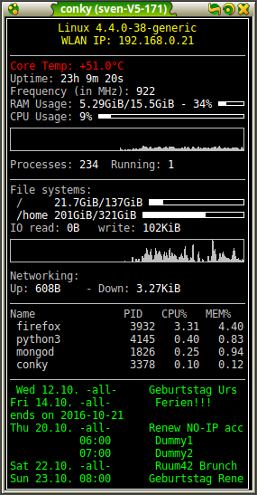

# nextcloud_calcli
Python based command line extension to display Owncloud/Nextcloud calendar agenda within conky 

## Requirements

- Python3
- caldav library (pip3 install caldav)
- create `.nextcloud_cal.ini` in your home directory. Use the following syntax:

    [DEFAULT] 
    user = user 
    pwd = guggus 
    url = https://yourserver/remote.php/dav/calendars/user/default/ 
    ssl = True || False (in case your certificate can't be verified)
    urgent_words=BirhtDay, meeting #case insesitive
    urgent_cals=Contact birthdays
    urgent_color=db6823
    summary_length=20
    lines_to_display=10
    time_delta=20

## Adaptations
In .conkyrc just add the following line:

    ${execi 600 python3 /pathTo/nextcloud_cal.py}

